# Igra Service - Key Management Architecture

This document provides a comprehensive, accurate diagram of all cryptographic keys, passphrases, and secrets used by a single **igra-service** instance.

---

## Overview

Each Igra service instance manages **three independent key systems**:

1. **HD Wallet Keys** - For threshold Schnorr signing (transaction signatures)
2. **Ed25519 Peer Keys** - For authenticated gossip transport
3. **Validator Public Keys** - For external event verification (Hyperlane/LayerZero)

---

## Key Management Diagram

```mermaid
graph TB
    subgraph External["🔐 External Secrets (Environment/Config)"]
        ENV_WALLET_SECRET["🔑 KASPA_IGRA_WALLET_SECRET<br/>(Environment Variable)<br/><br/>PURPOSE: Encryption key for HD mnemonics<br/>FORMAT: UTF-8 string<br/>USED BY: XChaCha20Poly1305 cipher"]

        TOML_MNEMONICS["📄 hd.mnemonics<br/>(Config File - Plaintext)<br/><br/>PURPOSE: BIP39 seed phrases<br/>FORMAT: 12-24 word phrases<br/>SECURITY: ⚠️ Plaintext in config<br/>ENCRYPTED ON: First load"]

        TOML_PASSPHRASE["📄 hd.passphrase<br/>(Config File - Optional)<br/><br/>PURPOSE: BIP39 passphrase (13th/25th word)<br/>FORMAT: UTF-8 string<br/>SECURITY: ⚠️ Plaintext in config"]

        TOML_IROH_SEED["📄 iroh.signer_seed_hex<br/>(Config File)<br/><br/>PURPOSE: Ed25519 seed for peer auth<br/>FORMAT: 64-char hex (32 bytes)<br/>SECURITY: ⚠️ Plaintext in config"]

        TOML_VALIDATOR_KEYS["📄 hyperlane.domains[].validators[]<br/>(Config File)<br/><br/>PURPOSE: Validator public keys (verification only)<br/>FORMAT: Hex secp256k1 pubkeys (33 or 65 bytes)<br/>SECURITY: ✅ Public keys (safe to store)"]
    end

    subgraph Storage["💾 Persistent Storage (RocksDB / Config File)"]
        ENCRYPTED_MNEMONICS["🔒 encrypted_mnemonics<br/>(Saved to Config File)<br/><br/>ENCRYPTION: XChaCha20Poly1305<br/>KEY: KASPA_IGRA_WALLET_SECRET<br/>STRUCTURE: Encryptable&lt;Vec&lt;PrvKeyData&gt;&gt;<br/>FILE: igra-config.toml"]

        XPUBS["📋 hd.xpubs[]<br/>(Config File)<br/><br/>PURPOSE: Extended public keys (watch-only signers)<br/>FORMAT: BIP32 xpub strings<br/>SECURITY: ✅ Public keys"]
    end

    subgraph Runtime["⚡ Runtime (In-Memory Only)"]
        DECRYPTED_MNEMONIC["🔓 Decrypted Mnemonic<br/>(PrvKeyData in memory)<br/><br/>SCOPE: Per signing operation<br/>ZEROED: After use (Zeroize trait)<br/>CONTAINS: BIP39 mnemonic + metadata"]

        XPRV["🔑 Extended Private Key (xprv)<br/>(kaspa_bip32::ExtendedPrivateKey)<br/><br/>DERIVED FROM: BIP39 mnemonic + passphrase<br/>STANDARD: BIP32 HD derivation<br/>SCOPE: Per signing operation"]

        DERIVED_PRIVKEY["🔑 Derived Private Key<br/>(secp256k1::SecretKey 32 bytes)<br/><br/>DERIVATION: xprv.derive_path(derivation_path)<br/>DEFAULT PATH: None (root key)<br/>CUSTOM PATH: e.g., m/45'/111111'/0'/0/0<br/>SCOPE: Per signing operation"]

        SIGNING_KEYPAIR["🔐 SigningKeypair<br/>(foundation/hd.rs)<br/><br/>CONTAINS:<br/>- public_key: secp256k1::PublicKey<br/>- secret_bytes: [u8; 32]<br/>ZEROED: On drop (Zeroize trait)"]

        ED25519_SIGNER["🔐 Ed25519Signer<br/>(infrastructure/transport/iroh/identity.rs)<br/><br/>CONTAINS:<br/>- peer_id: PeerId<br/>- key: ed25519_dalek::SigningKey<br/>DERIVED FROM: iroh.signer_seed_hex"]

        ED25519_VERIFIER["🔍 StaticEd25519Verifier<br/>(infrastructure/transport/iroh/identity.rs)<br/><br/>CONTAINS:<br/>- HashMap&lt;PeerId, VerifyingKey&gt;<br/>LOADED FROM: iroh.verifier_keys[]<br/>PURPOSE: Verify peer message signatures"]

        VALIDATOR_PUBKEYS["🔍 Validator PublicKeys<br/>(secp256k1::PublicKey)<br/><br/>LOADED FROM: hyperlane.domains[].validators[]<br/>PURPOSE: Verify external event signatures<br/>USED BY: domain/validation/hyperlane.rs"]
    end

    %% Flow: HD Wallet Key Lifecycle
    TOML_MNEMONICS -->|"1. First load:<br/>encrypt with WALLET_SECRET"| ENCRYPTED_MNEMONICS
    ENV_WALLET_SECRET -->|"Decryption key"| ENCRYPTED_MNEMONICS
    ENCRYPTED_MNEMONICS -->|"2. On signing:<br/>decrypt_mnemonics()"| DECRYPTED_MNEMONIC
    TOML_PASSPHRASE -->|"Optional BIP39 passphrase"| DECRYPTED_MNEMONIC
    DECRYPTED_MNEMONIC -->|"3. BIP32 derivation:<br/>get_xprv(payment_secret)"| XPRV
    XPRV -->|"4. Derive signing key:<br/>derive_path(derivation_path)"| DERIVED_PRIVKEY
    DERIVED_PRIVKEY -->|"5. Create keypair"| SIGNING_KEYPAIR
    SIGNING_KEYPAIR -->|"6. Sign PSKT inputs:<br/>Schnorr signatures"| TX_SIG["✍️ Transaction Signature<br/>(secp256k1 Schnorr)<br/><br/>SIGNS: Per-input sighash<br/>ALGORITHM: BIP340 Schnorr<br/>OUTPUT: 64-byte signature"]

    %% Flow: Ed25519 Peer Authentication
    TOML_IROH_SEED -->|"Parse hex → [u8; 32]"| ED25519_SIGNER
    ED25519_SIGNER -->|"Sign gossip messages"| PEER_MSG_SIG["✍️ Peer Message Signature<br/>(Ed25519)<br/><br/>SIGNS: Payload hash (BLAKE3)<br/>OUTPUT: 64-byte signature"]

    TOML_VALIDATOR_KEYS -->|"Parse hex → secp256k1::PublicKey"| ED25519_VERIFIER
    ED25519_VERIFIER -->|"Verify peer signatures"| PEER_MSG_SIG

    %% Flow: Validator Verification
    TOML_VALIDATOR_KEYS -->|"Parse hex → secp256k1::PublicKey"| VALIDATOR_PUBKEYS
    VALIDATOR_PUBKEYS -->|"Verify Hyperlane<br/>checkpoint signatures"| EVENT_SIG["🔍 Event Signature Verification<br/>(secp256k1 ECDSA)<br/><br/>VERIFIES: Hyperlane validator sigs<br/>THRESHOLD: m-of-n (e.g., 2-of-3)<br/>ALGORITHM: ECDSA recovery"]

    %% Security Notes
    ENV_WALLET_SECRET -.->|"⚠️ CRITICAL: Keep secret"| NOTE1["🔒 Security Note 1:<br/>WALLET_SECRET must be kept secret.<br/>Compromise = full mnemonic access"]
    TOML_MNEMONICS -.->|"⚠️ Encrypt immediately"| NOTE2["🔒 Security Note 2:<br/>Plaintext mnemonics in config are<br/>encrypted on first load and removed.<br/>Use encrypted_mnemonics afterward."]
    SIGNING_KEYPAIR -.->|"✅ Zeroized on drop"| NOTE3["🔒 Security Note 3:<br/>Private keys exist in memory only<br/>during signing and are zeroized after."]

    style ENV_WALLET_SECRET fill:#e03131,stroke:#c92a2a,stroke-width:3px,color:#fff
    style TOML_MNEMONICS fill:#d9480f,stroke:#e67700,stroke-width:2px,color:#fff
    style TOML_PASSPHRASE fill:#f59f00,stroke:#fab005,stroke-width:2px,color:#000
    style TOML_IROH_SEED fill:#d9480f,stroke:#e67700,stroke-width:2px,color:#fff
    style TOML_VALIDATOR_KEYS fill:#339af0,stroke:#1971c2,stroke-width:2px,color:#fff
    style ENCRYPTED_MNEMONICS fill:#37b24d,stroke:#2b8a3e,stroke-width:2px,color:#fff
    style XPUBS fill:#339af0,stroke:#1971c2,stroke-width:2px,color:#fff
    style DECRYPTED_MNEMONIC fill:#fab005,stroke:#f59f00,stroke-width:2px,color:#000
    style XPRV fill:#e03131,stroke:#c92a2a,stroke-width:2px,color:#fff
    style DERIVED_PRIVKEY fill:#e03131,stroke:#c92a2a,stroke-width:2px,color:#fff
    style SIGNING_KEYPAIR fill:#e03131,stroke:#c92a2a,stroke-width:3px,color:#fff
    style ED25519_SIGNER fill:#e03131,stroke:#c92a2a,stroke-width:3px,color:#fff
    style ED25519_VERIFIER fill:#339af0,stroke:#1971c2,stroke-width:2px,color:#fff
    style VALIDATOR_PUBKEYS fill:#339af0,stroke:#1971c2,stroke-width:2px,color:#fff
    style TX_SIG fill:#37b24d,stroke:#2b8a3e,stroke-width:2px,color:#fff
    style PEER_MSG_SIG fill:#37b24d,stroke:#2b8a3e,stroke-width:2px,color:#fff
    style EVENT_SIG fill:#339af0,stroke:#1971c2,stroke-width:2px,color:#fff
    style NOTE1 fill:#495057,stroke:#343a40,stroke-width:2px,color:#fff
    style NOTE2 fill:#495057,stroke:#343a40,stroke-width:2px,color:#fff
    style NOTE3 fill:#495057,stroke:#343a40,stroke-width:2px,color:#fff
```



---

## Detailed Key Descriptions

### 1. HD Wallet Keys (Threshold Schnorr Signing)

#### 1.1 **KASPA_IGRA_WALLET_SECRET** (Environment Variable)
- **Purpose:** Encryption key for HD wallet mnemonics
- **Format:** UTF-8 string (arbitrary length, used as XChaCha20Poly1305 key material)
- **Storage:** Environment variable (must be set before service starts)
- **Security:**
  - ⚠️ **CRITICAL SECRET** - Compromise allows decryption of all mnemonics
  - Must be kept secret and never logged
  - Should be stored in secure secret management system (e.g., HashiCorp Vault, AWS Secrets Manager)
- **Used By:**
  - `igra-core/src/infrastructure/config/encryption.rs::load_wallet_secret()`
  - `igra-core/src/infrastructure/config/encryption.rs::encrypt_mnemonics()`
  - `PsktHdConfig::decrypt_mnemonics()`
- **Code Reference:** `igra-core/src/infrastructure/config/mod.rs:49`

---

#### 1.2 **hd.mnemonics** (Config File - Plaintext, Temporary)
- **Purpose:** BIP39 seed phrases for HD wallet key derivation
- **Format:** Array of 12-word or 24-word BIP39 mnemonic phrases (English)
- **Storage:** `igra-config.toml` (plaintext, only before first encryption)
- **Security:**
  - ⚠️ **HIGH RISK IF STORED PLAINTEXT** - Full wallet access
  - Encrypted on first load using `KASPA_IGRA_WALLET_SECRET`
  - After encryption, plaintext mnemonics removed from config
  - Replaced by `encrypted_mnemonics` field
- **Example:**
  ```toml
  [hd]
  mnemonics = [
      "abandon abandon abandon abandon abandon abandon abandon abandon abandon abandon abandon about",
      "zoo zoo zoo zoo zoo zoo zoo zoo zoo zoo zoo wrong"
  ]
  ```
- **Encrypted Format:** `Encryptable<Vec<PrvKeyData>>` (XChaCha20Poly1305)
- **Code Reference:**
  - `igra-core/src/infrastructure/config/types.rs:30` (plaintext)
  - `igra-core/src/infrastructure/config/types.rs:32` (encrypted)
  - `igra-core/src/infrastructure/config/encryption.rs:20-38` (encryption logic)

---

#### 1.3 **hd.passphrase** (Config File - Optional)
- **Purpose:** BIP39 passphrase (sometimes called "13th word" or "25th word")
- **Format:** UTF-8 string (arbitrary length)
- **Storage:** `igra-config.toml` (plaintext)
- **Security:**
  - ⚠️ **SENSITIVE** - Changes derived keys if modified
  - Optional: if not provided, empty string used
  - Adds additional layer of security (attacker needs both mnemonic AND passphrase)
- **Usage:**
  - Combined with mnemonic during BIP32 seed derivation
  - Used in `key_data.get_xprv(payment_secret)`
- **Code Reference:**
  - `igra-core/src/infrastructure/config/types.rs:38`
  - `igra-core/src/application/event_processor.rs:300`

---

#### 1.4 **encrypted_mnemonics** (Config File - Encrypted)
- **Purpose:** Encrypted storage of HD wallet mnemonics
- **Format:** Base64-encoded `Encryptable<Vec<PrvKeyData>>`
- **Encryption:** XChaCha20Poly1305 authenticated encryption
- **Storage:** `igra-config.toml` (saved after initial encryption)
- **Security:**
  - ✅ **SAFE TO STORE** - Requires `WALLET_SECRET` to decrypt
  - Cannot be decrypted without environment variable
  - Authenticated encryption prevents tampering
- **Structure:**
  ```rust
  Encryptable<Vec<PrvKeyData>>
  where PrvKeyData contains:
    - Encrypted mnemonic bytes
    - Encryption kind (XChaCha20Poly1305)
    - Nonce and authentication tag
  ```
- **Code Reference:**
  - `igra-core/src/infrastructure/config/types.rs:32`
  - `igra-core/src/infrastructure/config/encryption.rs:41-53` (decryption)

---

#### 1.5 **hd.xpubs** (Config File - Public Keys)
- **Purpose:** Extended public keys for watch-only co-signers
- **Format:** Array of BIP32 xpub strings (e.g., `xpub6D4BDPcP2GT577Vvch3R8wDkScZWzQzMMUm3PWbmWvVJrZwQY4VUNgqFJPMM3No2dFDFGTsxxpG5uJh7n7epu4trkrX7x7DogT5Uv6fcLW5`)
- **Storage:** `igra-config.toml` (plaintext)
- **Security:**
  - ✅ **PUBLIC KEYS** - Safe to store and share
  - Used for co-signers who don't have private keys on this node
  - Allows constructing multisig redeem scripts without private keys
- **Usage:**
  - Derive public keys for multisig participants
  - Build multisig redeem scripts
  - Verify that signatures match expected public keys
- **Code Reference:**
  - `igra-core/src/infrastructure/config/types.rs:34`
  - `igra-core/src/foundation/hd.rs:76-86` (derivation)

---

#### 1.6 **hd.derivation_path** (Config File - Optional)
- **Purpose:** BIP32 derivation path for HD key derivation
- **Format:** BIP32 path string (e.g., `m/45'/111111'/0'/0/0`)
- **Storage:** `igra-config.toml` (plaintext)
- **Default:** `None` or `"m"` (use root key directly)
- **Security:** ✅ **NOT SECRET** - Public derivation path
- **Usage:**
  - Allows multiple keys from single mnemonic
  - Standard paths: BIP44, BIP84, custom
  - Applied during `xprv.derive_path(derivation_path)`
- **Code Reference:**
  - `igra-core/src/infrastructure/config/types.rs:42`
  - `igra-core/src/foundation/hd.rs:96-99` (parsing)

---

#### 1.7 **SigningKeypair** (Runtime - In-Memory Only)
- **Purpose:** Ephemeral keypair for signing PSKT inputs
- **Structure:**
  ```rust
  struct SigningKeypair {
      public_key: secp256k1::PublicKey,  // 33 bytes compressed
      secret_bytes: [u8; 32],            // Private key
  }
  ```
- **Lifetime:**
  - Created: When signing operation begins
  - Destroyed: Immediately after signing completes
  - Zeroized: Private key bytes overwritten with zeros on drop
- **Security:**
  - ✅ **MEMORY-ONLY** - Never persisted to disk
  - ✅ **ZEROIZED** - Automatic zeroing via Zeroize trait
  - ⚠️ **VULNERABLE TO MEMORY DUMPS** - Present in process memory during signing
- **Derivation Chain:**
  ```
  Mnemonic → BIP32 Seed → Extended Private Key (xprv)
    → Derive with path → secp256k1 SecretKey
    → SigningKeypair
  ```
- **Code Reference:**
  - `igra-core/src/foundation/hd.rs:20-55` (struct definition)
  - `igra-core/src/application/event_processor.rs:303-305` (usage)

---

### 2. Ed25519 Peer Authentication Keys (Gossip Transport)

#### 2.1 **iroh.signer_seed_hex** (Config File)
- **Purpose:** Seed for Ed25519 keypair (peer authentication in gossip network)
- **Format:** 64-character hex string (32 bytes)
- **Storage:** `igra-config.toml` (plaintext)
- **Security:**
  - ⚠️ **SENSITIVE** - Allows impersonating this peer
  - Compromise allows attacker to send fake gossip messages as this peer
  - Equivocation detection would catch malicious behavior, but disrupts protocol
- **Usage:**
  - Derive Ed25519 signing key: `SigningKey::from_bytes(&seed_bytes)`
  - Sign all outgoing gossip messages (proposals, CRDT updates, sync requests)
  - Messages rejected if signature invalid
- **Code Reference:**
  - `igra-core/src/infrastructure/config/types.rs:211`
  - `igra-core/src/infrastructure/transport/iroh/identity.rs:14-15` (key derivation)
  - `igra-core/src/bin/devnet-keygen.rs:152-160` (generation)

---

#### 2.2 **iroh.peer_id** (Config File)
- **Purpose:** Human-readable peer identifier
- **Format:** String (e.g., `peer-a1b2c3d4e5f6g7h8`)
- **Storage:** `igra-config.toml` (plaintext)
- **Derivation:** `BLAKE3(signer_seed_hex)[0..8]` (first 8 bytes, hex-encoded, prefixed with `peer-`)
- **Security:** ✅ **PUBLIC** - Not secret, used for logging and identification
- **Usage:**
  - Identify peer in logs, metrics, and debugging
  - Map peer IDs to verifying keys in `StaticEd25519Verifier`
- **Code Reference:**
  - `igra-core/src/infrastructure/config/types.rs:209`
  - `igra-core/src/bin/devnet-keygen.rs:89-94` (derivation)

---

#### 2.3 **iroh.verifier_keys** (Config File)
- **Purpose:** Ed25519 public keys of all peers in the gossip network (whitelist)
- **Format:** Array of hex-encoded Ed25519 public keys (64 characters = 32 bytes each)
- **Storage:** `igra-config.toml` (plaintext)
- **Security:**
  - ✅ **PUBLIC KEYS** - Safe to store and share
  - Used to verify incoming messages from peers
  - Static whitelist prevents Sybil attacks
- **Example:**
  ```toml
  [iroh]
  verifier_keys = [
      "a1b2c3d4e5f6...",  # peer-1's Ed25519 pubkey
      "b2c3d4e5f6a1...",  # peer-2's Ed25519 pubkey
      "c3d4e5f6a1b2..."   # peer-3's Ed25519 pubkey
  ]
  ```
- **Usage:**
  - Build `StaticEd25519Verifier` with `HashMap<PeerId, VerifyingKey>`
  - Verify signatures on all incoming gossip messages
  - Reject messages from unknown peers (not in whitelist)
- **Code Reference:**
  - `igra-core/src/infrastructure/config/types.rs:213`
  - `igra-core/src/infrastructure/transport/iroh/identity.rs:37-59` (verifier implementation)

---

### 3. Validator Public Keys (External Event Verification)

#### 3.1 **hyperlane.domains[].validators[]** (Config File)
- **Purpose:** Hyperlane validator public keys for verifying cross-chain messages
- **Format:** Array of hex-encoded secp256k1 ECDSA public keys
  - Compressed (33 bytes): `02...` or `03...` prefix
  - Uncompressed (65 bytes): `04...` prefix
  - Optional `0x` prefix accepted
- **Storage:** `igra-config.toml` (plaintext)
- **Security:**
  - ✅ **PUBLIC KEYS** - Safe to store and share
  - Used only for signature verification, not signing
- **Per-Domain Configuration:**
  ```toml
  [[hyperlane.domains]]
  domain = 42161  # Arbitrum
  threshold = 2
  validators = [
      "0x03a1b2c3d4...",  # Validator 1 pubkey
      "0x02b2c3d4e5...",  # Validator 2 pubkey
      "0x03c3d4e5f6..."   # Validator 3 pubkey
  ]
  ```
- **Usage:**
  - Verify Hyperlane checkpoint signatures (ECDSA)
  - Require `threshold` valid signatures from validator set
  - Used in `domain/validation/hyperlane.rs::verify_event()`
- **Code Reference:**
  - `igra-core/src/infrastructure/config/types.rs:178` (config structure)
  - `igra-core/src/domain/validation/mod.rs:12-29` (parsing)
  - `igra-core/src/domain/validation/hyperlane.rs:130-145` (verification)

---

#### 3.2 **hyperlane.domains[].threshold** (Config File)
- **Purpose:** Number of required validator signatures (m-of-n threshold)
- **Format:** Integer (e.g., `2` for 2-of-3 multisig)
- **Storage:** `igra-config.toml` (plaintext)
- **Security:** ✅ **NOT SECRET** - Public threshold configuration
- **Usage:**
  - Verify that at least `threshold` validators signed the message
  - Used in `verify_event()` to check `matched >= threshold`
- **Code Reference:**
  - `igra-core/src/infrastructure/config/types.rs:181`
  - `igra-core/src/domain/validation/hyperlane.rs:146-157` (threshold check)

---

#### 3.3 **layerzero.endpoint_pubkeys[]** (Config File)
- **Purpose:** LayerZero endpoint public keys (single-signature verification)
- **Format:** Array of hex-encoded secp256k1 ECDSA public keys
- **Storage:** `igra-config.toml` (plaintext)
- **Security:** ✅ **PUBLIC KEYS** - Safe to store and share
- **Usage:**
  - Verify single signature from LayerZero endpoint
  - Simpler than Hyperlane (no threshold, single endpoint signs)
- **Code Reference:**
  - `igra-core/src/infrastructure/config/types.rs:203`

---

## Key Lifecycle and Security Properties

### HD Wallet Key Lifecycle

```
┌─────────────────────────────────────────────────────────────────────┐
│ INITIALIZATION (One-time)                                           │
├─────────────────────────────────────────────────────────────────────┤
│ 1. Operator provides mnemonic in config (plaintext)                │
│ 2. Service reads KASPA_IGRA_WALLET_SECRET from environment         │
│ 3. encrypt_mnemonics() encrypts with XChaCha20Poly1305             │
│ 4. Encrypted blob saved to config, plaintext removed               │
└─────────────────────────────────────────────────────────────────────┘
                             ↓
┌─────────────────────────────────────────────────────────────────────┐
│ SIGNING OPERATION (Per transaction)                                 │
├─────────────────────────────────────────────────────────────────────┤
│ 1. decrypt_mnemonics() → load WALLET_SECRET → decrypt blob         │
│ 2. PrvKeyData.get_xprv(passphrase) → BIP32 ExtendedPrivateKey      │
│ 3. xprv.derive_path(derivation_path) → Derived Private Key         │
│ 4. Create SigningKeypair (secret_bytes: [u8; 32])                  │
│ 5. Sign PSKT inputs with Schnorr signatures                        │
│ 6. SigningKeypair dropped → secret_bytes zeroized                  │
└─────────────────────────────────────────────────────────────────────┘
```

### Ed25519 Peer Key Lifecycle

```
┌─────────────────────────────────────────────────────────────────────┐
│ INITIALIZATION (Service startup)                                    │
├─────────────────────────────────────────────────────────────────────┤
│ 1. Load iroh.signer_seed_hex from config                           │
│ 2. Parse hex → [u8; 32] seed bytes                                 │
│ 3. Ed25519Signer::from_seed(peer_id, seed)                         │
│ 4. Create SigningKey::from_bytes(&seed)                            │
│ 5. Load iroh.verifier_keys[] → parse → StaticEd25519Verifier       │
└─────────────────────────────────────────────────────────────────────┘
                             ↓
┌─────────────────────────────────────────────────────────────────────┐
│ GOSSIP MESSAGE (Per message sent)                                   │
├─────────────────────────────────────────────────────────────────────┤
│ 1. Serialize message payload                                       │
│ 2. Compute payload_hash = BLAKE3(payload)                          │
│ 3. Sign: signature = Ed25519.sign(payload_hash)                    │
│ 4. Send envelope: {payload, payload_hash, signature, metadata}     │
└─────────────────────────────────────────────────────────────────────┘
                             ↓
┌─────────────────────────────────────────────────────────────────────┐
│ GOSSIP MESSAGE (Per message received)                               │
├─────────────────────────────────────────────────────────────────────┤
│ 1. Receive envelope from peer                                      │
│ 2. Recompute payload_hash = BLAKE3(payload)                        │
│ 3. Verify payload_hash matches (constant-time comparison)          │
│ 4. Look up sender's VerifyingKey in whitelist                      │
│ 5. Verify: Ed25519.verify(payload_hash, signature, pubkey)         │
│ 6. Reject if unknown peer or invalid signature                     │
└─────────────────────────────────────────────────────────────────────┘
```

### Validator Key Usage

```
┌─────────────────────────────────────────────────────────────────────┐
│ EVENT VERIFICATION (Per external event)                             │
├─────────────────────────────────────────────────────────────────────┤
│ 1. Receive event with validator signatures (Hyperlane/LayerZero)   │
│ 2. Load validator public keys from config                          │
│ 3. Compute Hyperlane signing hash (CheckpointWithMessageId)        │
│ 4. Parse signatures from event.proof                               │
│ 5. Verify each signature against validator set                     │
│ 6. Count valid signatures                                          │
│ 7. Check: valid_count >= threshold                                 │
│ 8. Accept event if threshold met, reject otherwise                 │
└─────────────────────────────────────────────────────────────────────┘
```

---

## Security Model and Trust Assumptions

### Secrets That Must Be Protected

| Secret | Threat if Compromised | Mitigation |
|--------|----------------------|------------|
| **KASPA_IGRA_WALLET_SECRET** | Attacker can decrypt all mnemonics → full wallet control | Store in secure secret manager; rotate if leaked |
| **hd.mnemonics** (plaintext) | Attacker can derive all private keys → sign transactions | Encrypt immediately on first load; use encrypted_mnemonics |
| **hd.passphrase** | Combined with mnemonic, attacker can derive keys | Store securely; consider separate secret storage |
| **iroh.signer_seed_hex** | Attacker can impersonate peer in gossip | Equivocation detection catches malicious messages; rotate seed |

### Public Information (Safe to Store)

| Data | Why Safe |
|------|----------|
| **encrypted_mnemonics** | Requires WALLET_SECRET to decrypt; authenticated encryption prevents tampering |
| **hd.xpubs** | Public keys only; cannot derive private keys |
| **hd.derivation_path** | Public information; does not expose keys |
| **iroh.peer_id** | Public identifier; used for logging and routing |
| **iroh.verifier_keys[]** | Public keys; used for verification only |
| **hyperlane.domains[].validators[]** | Public keys; used for verification only |
| **hyperlane.domains[].threshold** | Public threshold configuration |

---

## Operational Best Practices

### 1. Key Generation (devnet-keygen)

The `devnet-keygen` binary generates all keys for a complete devnet setup:

```bash
cargo run --bin devnet-keygen > devnet-keys.json
```

**Output includes:**
- Wallet mnemonic (funding/mining)
- Per-signer mnemonics (threshold signing)
- Per-signer Ed25519 seeds (gossip authentication)
- Hyperlane validator keypairs
- EVM deployer keys (Anvil)
- Multisig address and redeem script

**Security:** Output contains **private keys** - store securely, delete after use.

**Code Reference:** `igra-core/src/bin/devnet-keygen.rs`

---

### 2. Initial Configuration

**Step 1: Generate Keys**
```bash
cargo run --bin devnet-keygen > keys.json
```

**Step 2: Extract Secrets**
```bash
# Signer 1 mnemonic
export SIGNER1_MNEMONIC=$(jq -r '.signers[0].mnemonic' keys.json)

# Signer 1 Iroh seed
export SIGNER1_IROH_SEED=$(jq -r '.signers[0].iroh_seed_hex' keys.json)

# Validator public keys (all signers need these)
export VALIDATOR_PUBKEYS=$(jq -r '.hyperlane_keys[] | .public_key_hex' keys.json)
```

**Step 3: Create Config**
```toml
# igra-config.toml
[hd]
mnemonics = ["${SIGNER1_MNEMONIC}"]  # Will be encrypted on first load
passphrase = ""  # Optional

[iroh]
signer_seed_hex = "${SIGNER1_IROH_SEED}"
verifier_keys = [
    "${SIGNER1_IROH_PUBKEY}",
    "${SIGNER2_IROH_PUBKEY}",
    "${SIGNER3_IROH_PUBKEY}"
]

[[hyperlane.domains]]
domain = 31337  # Anvil devnet
threshold = 2
validators = [
    "${VALIDATOR1_PUBKEY}",
    "${VALIDATOR2_PUBKEY}"
]
```

**Step 4: Set Environment Variable**
```bash
export KASPA_IGRA_WALLET_SECRET="your-strong-secret-here"
```

**Step 5: Start Service**
```bash
cargo run --bin kaspa-threshold-service -- --config igra-config.toml
```

**On first start:**
- Service encrypts plaintext `mnemonics` with `WALLET_SECRET`
- Saves `encrypted_mnemonics` to config
- Removes plaintext `mnemonics` from config
- Subsequent starts use `encrypted_mnemonics`

---

### 3. Key Rotation

#### Rotating HD Wallet Keys
1. Generate new mnemonic: `kaspa-wallet` CLI or `devnet-keygen`
2. Add to config: `hd.mnemonics = ["new-mnemonic"]`
3. Restart service → encrypts new mnemonic
4. Update multisig configuration with new public key
5. Coordinate with other signers to update redeem script

#### Rotating Ed25519 Peer Keys
1. Generate new seed: `openssl rand -hex 32`
2. Update config: `iroh.signer_seed_hex = "new-seed"`
3. Derive new peer_id: `peer_id_from_seed(new-seed)`
4. Share new public key with all peers
5. All peers update `iroh.verifier_keys[]` with new pubkey
6. Restart all services simultaneously (or use rolling restart with grace period)

#### Rotating WALLET_SECRET
**⚠️ CRITICAL: This re-encrypts all mnemonics**
1. Stop service
2. Decrypt all mnemonics with old `WALLET_SECRET`
3. Set new `KASPA_IGRA_WALLET_SECRET`
4. Remove `encrypted_mnemonics` from config
5. Add plaintext `mnemonics` temporarily
6. Restart service → re-encrypts with new secret
7. Verify `encrypted_mnemonics` saved with new key

---

### 4. Backup and Recovery

#### Critical Backups
- **KASPA_IGRA_WALLET_SECRET** - Cannot recover mnemonics without this
- **hd.mnemonics** (plaintext) - After encryption, only encrypted blob exists
- **hd.passphrase** - Required for key derivation
- **iroh.signer_seed_hex** - Required for peer authentication

#### Recovery Procedure
1. Restore `KASPA_IGRA_WALLET_SECRET` environment variable
2. Restore `igra-config.toml` with `encrypted_mnemonics`
3. Restore `iroh.signer_seed_hex` (or generate new and update peers)
4. Start service → automatically decrypts mnemonics on demand

#### Disaster Recovery (Lost WALLET_SECRET)
- **If mnemonic backup exists:** Restore plaintext mnemonic → re-encrypt with new secret
- **If no mnemonic backup:** **PERMANENT KEY LOSS** - Generate new keys and update multisig

---

## Code References

### Key Management Modules

| Module | Purpose | Key Functions |
|--------|---------|---------------|
| `foundation/hd.rs` | HD key derivation | `derive_pubkeys()`, `derive_keypair_from_key_data()` |
| `infrastructure/config/encryption.rs` | Mnemonic encryption | `encrypt_mnemonics()`, `decrypt_mnemonics()`, `load_wallet_secret()` |
| `infrastructure/config/types.rs` | Config structures | `PsktHdConfig`, `IrohRuntimeConfig`, `HyperlaneConfig` |
| `infrastructure/transport/iroh/identity.rs` | Peer auth keys | `Ed25519Signer`, `StaticEd25519Verifier` |
| `domain/validation/hyperlane.rs` | Validator verification | `verify_event()`, `hyperlane_signing_hash()` |
| `domain/validation/mod.rs` | Key parsing | `parse_validator_pubkeys()` |
| `application/event_processor.rs` | Signing orchestration | Uses decrypted mnemonics to sign PSKT inputs |

### Environment Variables

| Variable | Purpose | Required |
|----------|---------|----------|
| `KASPA_IGRA_WALLET_SECRET` | Encryption key for HD mnemonics | ✅ Yes (if HD keys used) |
| `KASPA_CONFIG_PATH` | Path to config file | ❌ No (defaults to `{data_dir}/igra-config.toml`) |
| `KASPA_DATA_DIR` | Data directory | ❌ No (defaults to `~/.kaspa-igra` or OS-specific) |

---

## Security Audit Summary

### ✅ Strong Security Properties

1. **Encrypted Storage:** HD mnemonics encrypted with XChaCha20Poly1305
2. **Memory Safety:** Private keys zeroized after use (Zeroize trait)
3. **Authenticated Gossip:** All messages signed with Ed25519, verified against whitelist
4. **Threshold Verification:** Hyperlane events require m-of-n validator signatures
5. **No Plaintext Persistence:** Mnemonics encrypted on first load, plaintext removed

### ⚠️ Security Considerations

1. **Environment Variable Security:** `WALLET_SECRET` must be protected (use secret manager)
2. **Memory Exposure:** Private keys exist in process memory during signing (vulnerable to memory dumps)
3. **Config File Permissions:** Ensure `igra-config.toml` has restrictive permissions (0600)
4. **Passphrase Storage:** `hd.passphrase` stored in plaintext (consider external secret storage)
5. **Iroh Seed Storage:** `signer_seed_hex` in plaintext (consider encryption or external storage)
6. **No HSM Support:** Keys exist in process memory (no hardware security module integration)

### 🔒 Recommended Mitigations

1. **Use Secret Manager:** Store `WALLET_SECRET` in HashiCorp Vault, AWS Secrets Manager, or similar
2. **Encrypt Config:** Encrypt entire `igra-config.toml` at rest using OS-level encryption
3. **File Permissions:** `chmod 600 igra-config.toml` (owner read/write only)
4. **Network Isolation:** Run service in isolated network segment
5. **Memory Protection:** Use memory-safe languages/techniques (Rust helps, but not immune to dumps)
6. **Regular Rotation:** Rotate `WALLET_SECRET` and peer seeds periodically
7. **Audit Logs:** Monitor for unauthorized decryption attempts or equivocation events

---

## Appendix: Key Format Examples

### BIP39 Mnemonic (12-word)
```
abandon abandon abandon abandon abandon abandon abandon abandon abandon abandon abandon about
```

### BIP39 Mnemonic (24-word)
```
zoo zoo zoo zoo zoo zoo zoo zoo zoo zoo zoo zoo zoo zoo zoo zoo zoo zoo zoo zoo zoo zoo zoo wrong
```

### BIP32 Extended Private Key (xprv)
```
xprv9s21ZrQH143K3QTDL4LXw2F7HEK3wJUD2nW2nRk4stbPy6cq3jPPqjiChkVvvNKmPGJxWUtg6LnF5kejMRNNU3TGtRBeJgk33yuGBxrMPHi
```

### BIP32 Extended Public Key (xpub)
```
xpub661MyMwAqRbcFtXgS5sYJABqqG9YLmC4Q1Rdap9gSE8NqtwybGhePY2gZ29ESFjqJoCu1Rupje8YtGqsefD265TMg7usUDFdp6W1EGMcet8
```

### secp256k1 Private Key (32 bytes hex)
```
e8f32e723decf4051aefac8e2c93c9c5b214313817cdb01a1494b917c8436b35
```

### secp256k1 Public Key Compressed (33 bytes hex)
```
03a1b2c3d4e5f67890abcdef1234567890abcdef1234567890abcdef12345678
```

### secp256k1 Public Key Uncompressed (65 bytes hex)
```
04a1b2c3d4e5f67890abcdef1234567890abcdef1234567890abcdef12345678
90abcdef1234567890abcdef1234567890abcdef1234567890abcdef123456
```

### Ed25519 Seed (32 bytes hex)
```
a1b2c3d4e5f67890abcdef1234567890abcdef1234567890abcdef1234567890
```

### Ed25519 Public Key (32 bytes hex)
```
b2c3d4e5f67890abcdef1234567890abcdef1234567890abcdef123456789012
```

---

**Document Version:** 1.0
**Last Updated:** 2026-01-21
**Audit Status:** ✅ Verified against source code
