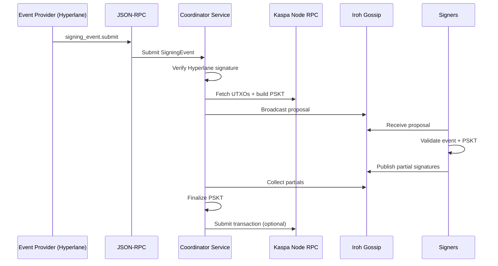
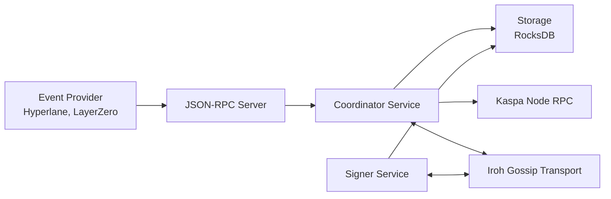

# Architecture (V1)

This document summarizes supported flows and the components required for V1 threshold signing.

## Supported Flows

Auditors should read this section alongside `docs/service/README.md` for API payloads.
For detailed flow breakdowns and cryptography notes, see `docs/service/Flows.md`.

- Event-driven (JSON-RPC): external system submits a `SigningEvent`; coordinator builds PSKT and proposes.
- Event-driven (file watcher): local watcher ingests `*.json` and forwards via JSON-RPC.
- Test-only PSKT build: local config provides recipient/amount and builds a PSKT (no event ingestion).
- Finalize-only: optional finalize+submit of a PSKT via env vars in the service binary.

## Flow Summary (V1)

Event-driven (JSON-RPC)
1) Ingest `SigningEvent` (`signing_event.submit`).
2) Verify event signature (Hyperlane) and validate schema/policy.
3) Build PSKT from Kaspa RPC UTXOs.
4) Propose session over Iroh gossip.
5) Signers validate + produce partial signatures.
6) Coordinator combines partials, finalizes, optionally submits.

Event-driven (file watcher)
1) Watch directory for `*.json`.
2) Parse file into `SigningEventParams`.
3) Forward to JSON-RPC handler (same as JSON-RPC flow).
4) Mark file as `.done` after successful ingestion.

Test-only PSKT build
1) Read config overrides (`runtime.test_*`).
2) Resolve redeem script (static or derived).
3) Build PSKT from Kaspa RPC UTXOs.
4) Print PSKT JSON to stdout.

Finalize-only (env vars)
1) Read PSKT JSON + required sigs + pubkeys from env.
2) Combine partials and finalize.
3) Submit to Kaspa node (optional).

## Workspace Layout

- `igra-core`: shared models, coordination, signing backends, storage, validation, and event ingestion pipeline.
- `igra-service`: service runtime, JSON-RPC, Iroh transport, and binaries.

## V1 Components

### Core

- `SigningEvent` model (event payload from external system).
- PSKT build/sign/finalize helpers.
- Coordinator and signer state machine logic.
- Event ingestion pipeline (shared by JSON-RPC and file-based providers).
- Signing backends (Threshold multisig, MuSig2, MPC) behind a common interface.

### Transport

- Iroh gossip transport.

### Storage

- RocksDB storage.

### RPC + Service

- `GrpcNodeRpc` (Kaspa node RPC client).
- JSON-RPC server (`/rpc`) for event ingestion.
- Hyperlane event verifier (validator signature check).
- Optional Hyperlane watcher (polls a directory).

### External Dependencies

- Kaspa node with `--utxoindex` (for PSKT UTXO lookup).
- Hyperlane validator (event source, signature authority).
- Event provider (Hyperlane/LayerZero/etc.) using JSON-RPC payloads.

## V1 Runtime Topology (Service)

1) Event provider submits `SigningEvent` via JSON-RPC.
2) Hyperlane signature is verified against validator set.
3) Coordinator builds PSKT from Kaspa RPC UTXOs.
4) Proposal is broadcast over Iroh gossip.
5) Signers validate, sign, and submit partial signatures.
6) Coordinator combines partials, finalizes, and (optionally) submits.

## Sequence Diagram (V1 Service)

## Flow Details (Auditor View)

Event-driven (JSON-RPC)
1) `signing_event.submit` arrives with `SigningEventParams`.
2) Event signature validation (`hyperlane::verify_event`) and policy checks.
3) Event hash + validation hash persisted in RocksDB.
4) PSKT built deterministically from node RPC UTXOs.
5) Proposal broadcast (Iroh) with `SigningEvent`, PSKT, and session metadata.
6) Signers reconstruct PSKT, validate outputs, and create partial signatures.
7) Coordinator collects partials, finalizes, and optionally submits.

Event-driven (file watcher)
1) Watcher parses `*.json` into `SigningEventParams`.
2) Same path as JSON-RPC from step (1) onward.
3) File renamed to `.done` on success for replay protection.

Test-only PSKT build
1) Local config provides output `address + amount` (no event ingestion).
2) PSKT built and printed for manual inspection.
3) No proposal broadcast, no signer coordination.

Finalize-only
1) Service loads PSKT JSON + pubkeys + required sigs from env.
2) PSKT finalized and submitted via Kaspa RPC.

## Component Diagram (V1)

