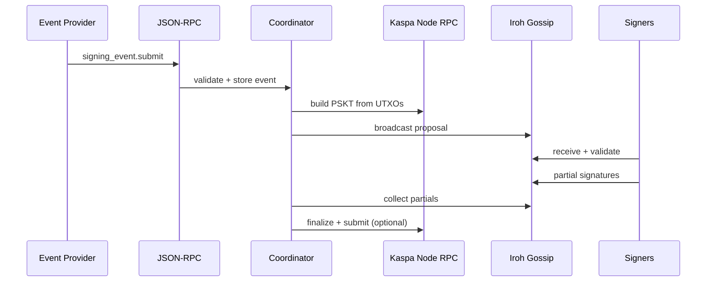
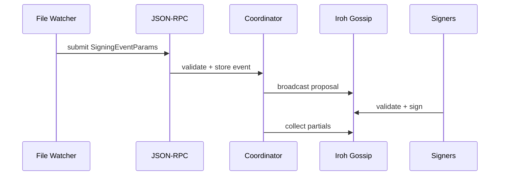
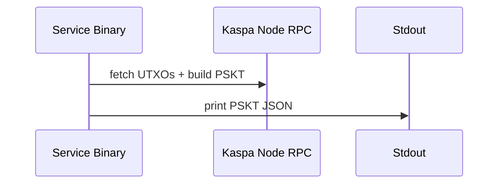
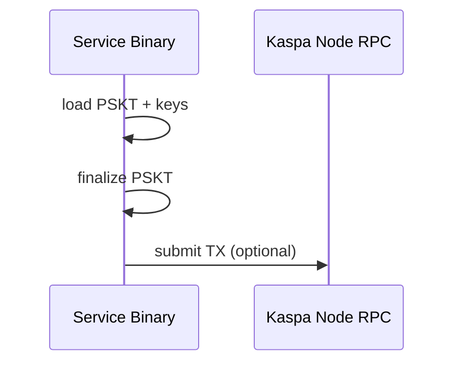

# Service Flows (V1)

This document provides auditor-focused flow breakdowns and cryptographic details for the
Igra service runtime.

## Cryptography and Key Material

The service uses multiple keypairs and curves, each for a distinct role:

- Kaspa transaction signing: secp256k1 Schnorr signatures (Kaspa standard).
- Hyperlane validator signatures: secp256k1 ECDSA (event authenticity).
- Iroh transport identities: Ed25519 keypairs (peer identity + envelope signing).

Key material separation is enforced:

- Kaspa signing keys never sign transport envelopes.
- Iroh Ed25519 keys never sign Kaspa transactions.
- Hyperlane validator keys are only used for event verification.

## Iroh Peer Key Management

The service expects each peer to have a stable Iroh identity:

- Preferred: set `iroh.peer_id` and `iroh.signer_seed_hex` in the INI file.
- If missing, the service creates and persists an identity at
  `<data_dir>/iroh/identity.json` (or `./.igra/iroh/identity.json`).
- The persisted identity is reused on subsequent runs to keep peer ids stable.

Rotation guidelines:

- To rotate a peer identity, stop the service and remove the identity file, then
  restart. Update `iroh.verifier_keys` for all peers to include the new public key.
- All peers must agree on the updated `iroh.verifier_keys` set before resuming.

## Flow A: Event-Driven (JSON-RPC)

Purpose: Ingest an external signing event and coordinate a threshold signing session.

Steps:
1) Client calls `signing_event.submit` with `SigningEventParams`.
2) Service verifies Hyperlane signature (if present) and enforces local policy.
3) Event hash and validation hash are stored in RocksDB.
4) Coordinator builds a PSKT using Kaspa RPC UTXO data.
5) Coordinator broadcasts the proposal over Iroh gossip.
6) Signers validate the event and PSKT, then emit partial signatures.
7) Coordinator combines partials, finalizes the PSKT, and optionally submits the TX.

## Flow B: Event-Driven (File Watcher)

Purpose: Ingest local `*.json` events using the same pipeline as JSON-RPC.

Steps:
1) Watcher scans a directory for `*.json`.
2) Each file is parsed into `SigningEventParams`.
3) Payload is forwarded to the JSON-RPC handler (Flow A steps 2-7).
4) File is renamed to `.done` after successful ingestion.

## Flow C: Test-Only PSKT Build

Purpose: Build a PSKT without any external event ingestion.

Steps:
1) Load `runtime.test_*` output overrides from config.
2) Resolve redeem script (static or derived from HD).
3) Build PSKT using Kaspa RPC UTXO data.
4) Print PSKT JSON to stdout for inspection.

## Flow D: Finalize-Only

Purpose: Finalize and submit a PSKT provided via env vars.

Steps:
1) Read PSKT JSON, required sigs, and pubkeys from environment.
2) Combine partials and finalize the PSKT.
3) Submit the finalized transaction to Kaspa RPC (optional).

## Audit DB Portability

Each peer stores requests using fixed prefixes so another signer can import the
DB and re-verify a session:

- `evt:` SigningEvent indexed by `event_hash`
- `req:` SigningRequest indexed by `request_id`
- `proposal:` StoredProposal with PSKT blob
- `req_input:` RequestInput entries
- `req_ack:` SignerAckRecord entries
- `req_sig:` PartialSigRecord entries

With these entries present, a peer can reconstruct the proposal, re-run hashes,
and verify partial signatures and the final transaction id.
