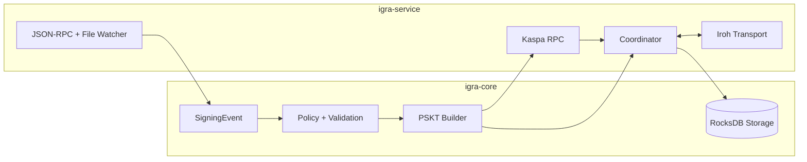

# Kaspa Threshold Signing (V1 Multisig)

This crate provides the V1 multisig threshold signing flow, including PSKT construction, coordination, and RPC wiring.

## Workspace Layout

- `igra-core`: shared models, coordination, signing backends, storage, validation, and event ingestion pipeline.
- `igra-service`: service runtime, JSON-RPC, Iroh transport, and binaries.

## Architecture Diagram



## Supported Flows (V1)

- Event-driven (JSON-RPC): external signing event provides recipient+amount; optional finalize+submit.
- Event-driven (file watcher): local `*.json` is ingested and forwarded to JSON-RPC.
- Test-only config: build PSKT from config overrides for local testing.
- Finalize-only: finalize+submit a PSKT via env vars on startup.

For auditor-friendly flow diagrams and cryptography details, see `docs/service/Flows.md`.
Deployment, security, and integration guides are in `docs/service/DEPLOYMENT.md`, `docs/service/SECURITY.md`, and `docs/service/INTEGRATION.md`.
API endpoints are documented in `docs/service/API_REFERENCE.md`.

## Service (event-driven)

Run the service binary with configuration stored in RocksDB, an INI file, or a TOML file.

### Config File

On startup the service first checks RocksDB for a stored config. If missing, it loads
an INI or TOML file and persists it into RocksDB for subsequent runs.

Config path resolution:

- `KASPA_CONFIG_PATH` if set, otherwise
- `<KASPA_DATA_DIR>/igra-config.ini` or `<KASPA_DATA_DIR>/igra-config.toml` if `KASPA_DATA_DIR` is set, otherwise
- `./.igra/igra-config.ini` or `./.igra/igra-config.toml`

RocksDB lives under `<data_dir>/threshold-signing`.

Example INI:

```bash
cat > ./.igra/igra-config.ini <<'INI'
[service]
node_rpc_url = grpc://127.0.0.1:16110
data_dir = ./.igra

[pskt]
source_addresses = kaspatest:...
redeem_script_hex = <hex>
sig_op_count = 2
fee_payment_mode = recipient_pays
fee_sompi = 0
change_address = kaspatest:...

[runtime]
test_mode = true
test_recipient = kaspatest:...
test_amount_sompi = 123456
session_timeout_seconds = 60

[signing]
backend = threshold

[rpc]
addr = 127.0.0.1:8088
enabled = true

[policy]
allowed_destinations = kaspatest:...
min_amount_sompi = 1000000
max_amount_sompi = 100000000000
max_daily_volume_sompi = 500000000000
require_reason = false

[group]
threshold_m = 2
threshold_n = 3
member_pubkeys = <hex_pubkey1>,<hex_pubkey2>
fee_rate_sompi_per_gram = 0
finality_blue_score_threshold = 0
dust_threshold_sompi = 0
min_recipient_amount_sompi = 0
session_timeout_seconds = 60

[iroh]
group_id = <32-byte-hex>
verifier_keys = coordinator-1:<hex_pubkey>
INI

cargo run -p igra-service --bin kaspa-threshold-service
```

Finalize and submit a combined PSKT from the service binary:

```bash
KASPA_FINALIZE_PSKT_JSON='<pskt-json>' \
KASPA_FINALIZE_REQUEST_ID=request-001 \
KASPA_FINALIZE_REQUIRED_SIGS=2 \
KASPA_FINALIZE_PUBKEYS=<pubkey1>,<pubkey2> \
KASPA_FINALIZE_NETWORK=testnet \
cargo run -p igra-service --bin kaspa-threshold-service
```

Dump an audit trail for a request (reads RocksDB and prints JSON):

```bash
KASPA_AUDIT_REQUEST_ID=request-001 \
cargo run -p igra-service --bin kaspa-threshold-service
```

## Flow Details (Auditor View)

Event-driven (JSON-RPC)
1) `signing_event.submit` receives `SigningEventParams`.
2) Hyperlane signature validation (if present) + policy checks.
3) Event hash + validation hash stored in RocksDB.
4) Coordinator builds PSKT from UTXOs via Kaspa RPC.
5) Proposal broadcast over Iroh gossip.
6) Signers validate PSKT, produce partial signatures, send to coordinator.
7) Coordinator combines partials, finalizes, and optionally submits.

Event-driven (file watcher)
1) Watcher reads `*.json` into `SigningEventParams`.
2) Same JSON-RPC flow as above.
3) File renamed to `.done` after success.

Test-only PSKT build
1) Load `runtime.test_*` overrides.
2) Build PSKT and print JSON.

Finalize-only
1) Read PSKT JSON and required keys from env vars.
2) Finalize and submit via Kaspa RPC.

Iroh configuration (INI keys):

- `iroh.peer_id` (string peer identifier used in envelopes)
- `iroh.signer_seed_hex` (32-byte Ed25519 seed hex)
- `iroh.verifier_keys` (comma-separated `peer_id:hex_pubkey` entries)
- `iroh.group_id` (32-byte hex group id)
- `iroh.network_id` (u8, default 0)
- `iroh.bootstrap` (comma-separated EndpointId list, optional; base32 strings)
- `iroh.bootstrap_addrs` (comma-separated `EndpointId@host:port` entries; optional static addresses used before discovery)
- `iroh.bind_port` (u16 bind port, optional)

Signing backend configuration:

- `signing.backend` (one of `threshold`, `musig2`, `mpc`)

If `iroh.peer_id` and `iroh.signer_seed_hex` are not set, the service
creates an identity file at `<data_dir>/iroh/identity.json` (or `./.igra/iroh/identity.json`)
and reuses it on subsequent runs.

Get an EndpointId (example):

```rust
let endpoint = iroh::Endpoint::builder().bind().await?;
println!("{}", endpoint.id());
```

### JSON-RPC API

The service exposes a JSON-RPC 2.0 endpoint at `/rpc`.
Health endpoints: `/health` and `/ready`.
Metrics endpoint: `/metrics` (Prometheus text format).
If `rpc.token` is set, clients must provide either
`Authorization: Bearer <token>` or `x-api-key: <token>`.

Method: `signing_event.submit`

`event_source` supports `hyperlane`, `layerzero`, `api`, `manual`, and `other`.

Params:

```json
{
  "session_id_hex": "<32-byte-hex>",
  "request_id": "req-001",
  "coordinator_peer_id": "coordinator-1",
  "expires_at_nanos": 1710000000000000000,
  "signing_event": {
    "event_id": "event-001",
    "event_source": { "hyperlane": { "domain": "ethereum", "sender": "0x..." } },
    "derivation_path": "m/45'/111111'/0'/0/0",
    "derivation_index": 0,
    "destination_address": "kaspatest:...",
    "amount_sompi": 123456,
    "metadata": { "reason": "payout" },
    "timestamp_nanos": 1710000000000000000,
    "signature_hex": "<hex-bytes-or-null>"
  }
}
```

Result:

```json
{
  "session_id_hex": "<32-byte-hex>",
  "event_hash_hex": "<32-byte-hex>",
  "validation_hash_hex": "<32-byte-hex>"
}
```

Hyperlane events must include a valid ECDSA secp256k1 signature matching one of
the configured validator public keys.

Example curl:

```bash
curl -s http://127.0.0.1:8088/rpc \
  -H 'Content-Type: application/json' \
  -d '{
    "jsonrpc": "2.0",
    "id": 1,
    "method": "signing_event.submit",
    "params": {
      "session_id_hex": "0101010101010101010101010101010101010101010101010101010101010101",
      "request_id": "req-001",
      "coordinator_peer_id": "coordinator-1",
      "expires_at_nanos": 1710000000000000000,
      "signing_event": {
        "event_id": "event-001",
        "event_source": { "hyperlane": { "domain": "ethereum", "sender": "0x..." } },
        "derivation_path": "m/45'/111111'/0'/0/0",
        "derivation_index": 0,
        "destination_address": "kaspatest:...",
        "amount_sompi": 123456,
        "metadata": { "reason": "payout" },
        "timestamp_nanos": 1710000000000000000,
        "signature_hex": null
      }
    }
  }'
```

### Hyperlane Local Event Source

If `hyperlane.events_dir` is set, the service will poll the directory and
ingest any `*.json` files that match the `SigningEventParams` schema above.
Processed files are renamed with a `.done` extension.

In production, the internal Hyperlane client should monitor validator S3 storage
and call the JSON-RPC endpoint with the same payload.

Example event file (`*.json`):

```json
{
  "session_id_hex": "0101010101010101010101010101010101010101010101010101010101010101",
  "request_id": "req-001",
  "coordinator_peer_id": "coordinator-1",
  "expires_at_nanos": 1710000000000000000,
  "signing_event": {
    "event_id": "event-001",
    "event_source": { "hyperlane": { "domain": "ethereum", "sender": "0x..." } },
    "derivation_path": "m/45'/111111'/0'/0/0",
    "derivation_index": 0,
    "destination_address": "kaspatest:...",
    "amount_sompi": 123456,
    "metadata": { "reason": "payout" },
    "timestamp_nanos": 1710000000000000000,
    "signature_hex": null
  }
}
```

## Signer Manual (V1 Multisig)

This describes how a multisig group participates using the service and Iroh transport.

Each signer should run:

- A Kaspa node with `--utxoindex` for RPC-backed PSKT creation.
- A Hyperlane validator (their standard deployment), plus the local event source or RPC client that feeds signing events.

### Group Agreement (before running anything)

All signers must agree on:

- `group_id` (32-byte hex) for the signing group.
- `network_id` (u8; use the same value across all peers).
- `m-of-n` policy, derivation path, and ordered xpubs or derived pubkeys for the redeem script.
- Address set allowed to spend from (source addresses).
- A coordinator peer id string (used in envelopes).
- Each signer’s Iroh EndpointId (shared via an out-of-band channel).
- Each signer’s Ed25519 verification key (shared via `peer_id:hex_pubkey` list).
- Hyperlane validator list (secp256k1 pubkeys in hex) for signature verification.
- LayerZero endpoint pubkeys (secp256k1 pubkeys in hex) when using LayerZero events.

The group can either share xpubs and a derivation path (each signer derives the same pubkey for that
path), or share the derived pubkeys directly. The ordered pubkey list defines the redeem script.

### Coordinator Steps (service)

1) Set INI values:
   - `iroh.peer_id` and `iroh.signer_seed_hex` (or leave empty to auto-create an identity file)
   - `iroh.verifier_keys`, `iroh.group_id`, `iroh.network_id`, `iroh.bootstrap`
   - `hyperlane.validators` for signature verification
   - `layerzero.endpoint_pubkeys` for signature verification (LayerZero events only)
   - `pskt.source_addresses` and `pskt.redeem_script_hex` (or `hd.*` inputs)
   - For local testing, set `runtime.test_mode`, `runtime.test_recipient`, `runtime.test_amount_sompi`

If you use `hd.mnemonics`, set `KASPA_IGRA_WALLET_SECRET` in the environment before the first run. The
service encrypts and stores mnemonics using the same wallet-core mechanisms as `kaspa-cli`, then you
should remove `hd.mnemonics` from the INI. The secret is required on every start that uses HD mnemonics.
2) Run the service:

```bash
cargo run -p igra-service --bin kaspa-threshold-service
```

### Signing Event API (expected payload)

The service expects a `SigningEvent` payload from your external system:

```json
{
  "event_id": "event-001",
  "event_source": { "api": { "issuer": "bridge-service" } },
  "derivation_path": "m/45'/111111'/0'/0/0",
  "derivation_index": 0,
  "destination_address": "kaspatest:...",
  "amount_sompi": 123456,
  "metadata": {
    "reason": "payout",
    "asset": "KAS"
  },
  "timestamp_nanos": 1710000000000000000,
  "signature_hex": null
}
```

`derivation_path` must be explicit and match the group’s agreed HD path. Include
`derivation_index` if you also want to track the index alongside the path. If
`derivation_index` is provided, the service enforces the deterministic path:
`m/45'/111111'/0'/0/{index}`.

The coordinator uses this payload when calling `ServiceFlow::propose_from_rpc(...)`:

```rust
flow.propose_from_rpc(
    &config,
    session_id,
    request_id,
    signing_event,
    expires_at_nanos,
    coordinator_peer_id,
).await?;
```

### Signer Steps (service)

1) Set INI values:
   - `iroh.peer_id` and `iroh.signer_seed_hex` (unique per signer)
   - `iroh.group_id`, `iroh.network_id`, `iroh.bootstrap`
   - `iroh.verifier_keys` including every peer (including this signer)
   - `hyperlane.validators`
2) Run the signer service and connect to coordinator:

```bash
cargo run -p igra-service --bin kaspa-threshold-service
```

### What each signer should verify

- The `group_id` and `network_id` match the group agreement.
- The redeem script and pubkey order match the group’s agreed policy.
- The PSKT outputs match intended recipients and amounts.
- The coordinator peer id and verification keys are correct.
- The Hyperlane signature validates against the agreed validator set.

### Notes

- Each signer’s `iroh.verifier_keys` must include all participating peers, including the signer itself.
- `iroh.bootstrap` should contain at least one reachable EndpointId (usually the coordinator).

## Integration Test (ignored)

The RPC integration test is ignored by default and expects a local node with `--utxoindex`:

```bash
KASPA_NODE_URL=grpc://127.0.0.1:16110 \
KASPA_SOURCE_ADDRESSES=kaspatest:... \
KASPA_REDEEM_SCRIPT_HEX=<hex> \
KASPA_RECIPIENT_ADDRESS=kaspatest:... \
KASPA_RECIPIENT_AMOUNT=123456 \
cargo test -p igra-service --test rpc_integration -- --ignored
```

The Iroh transport integration test is ignored by default because it requires reachable peers:

```bash
cargo test -p igra-service --test iroh_transport -- --ignored
```
